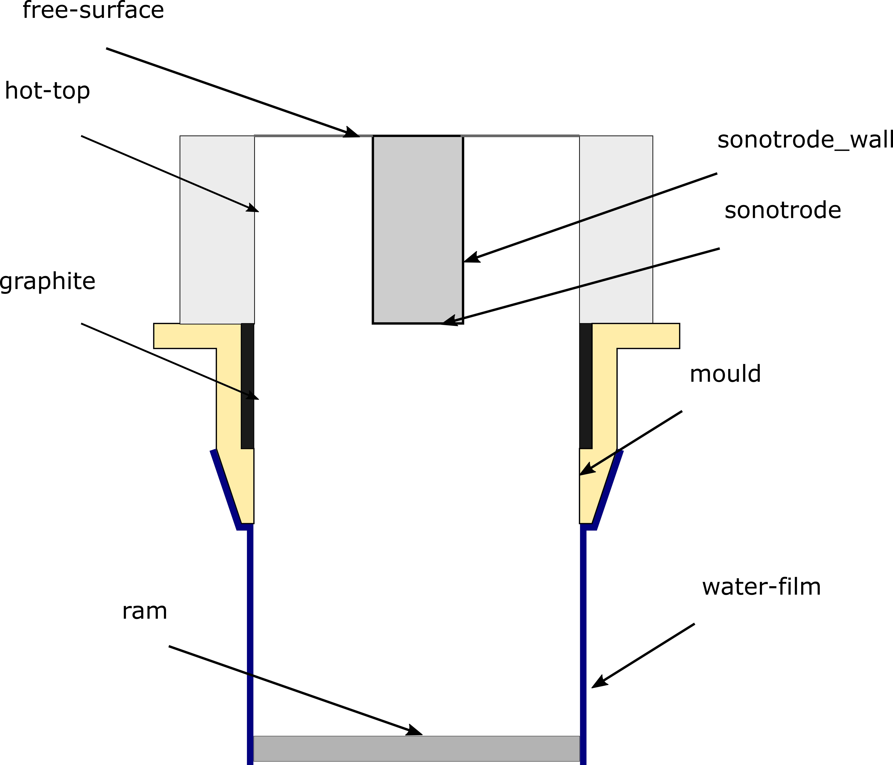

==========================================
Tutorial: Acoustic streaming in a DC mould
==========================================

This tutorial describes how to pre-process, run and post-process an acoustic 
streaming case with acousticStreamingFoam.

  The USDC casting geometry that is used in this tutorial.

Pre-processing
==============

Change to the case directory.

.. code-block:: console

  $ cd acousticStreamingFoam/tutorials/helmholtz/acousticStreamingFoam/USDC

Mesh generation
---------------

Generate the mesh.

.. code-block:: console

  $ cd ..
  $ blockMesh

Boundary and initial conditions
-------------------------------

Acoustic pressure
^^^^^^^^^^^^^^^^^

The complex acoustic pressure :math:`{P}` is calculated by solving for its 
real and imaginary parts separately. The real and imaginary parts of the 
acoustic pressure, :math:`\Re(P)` and :math:`\Im(P)`, at the sonotrode are
therefore prescriped in separate files: ``0/p_Re`` and ``0/p_Im``.

.. code-block:: cpp 
  
  sonotrode
  {
      type            fixedGradient;
      gradient        uniform 4e7;
  }

Physical properties
-------------------

Transport properties
^^^^^^^^^^^^^^^^^^^^

The `transport properties <../solver/acousticStreamingFoam.html#nomenclature>`_ are prescribed in the constant/transportProperties dictionary file.

Example usage:

.. code-block:: cpp

  nu     [ 0  2 -1 0 0 0 0 ] 1e-05;
  // Acoustic properties
  omega  [ 0  0 -1 0 0 0 0 ] 125663.70614359173;
  c      [ 0  1 -1 0 0 0 0 ] 4600.0;
  rho    [ 1 -3  0 0 0 0 0 ] 2378.652;
  phorn  [ 1 -1 -2 0 0 0 0 ] 5e5;
  pblake [ 1 -1 -2 0 0 0 0 ] 320386.12807758985;
  N      [ 0 -3  0 0 0 0 0 ] 1.0e3;

  AbyN
  {
    type                table;
    format              foam;
    file                "constant/AbyN";
    outOfBounds         clamp;
    interpolationScheme linear;
  }
  
  BbyN
  {
    type                table;
    format              foam;
    file                "constant/BbyN";
    outOfBounds         clamp;
    interpolationScheme linear;
  }

:math:`\frac{\mathcal{A}}{N}` and :math:`\frac{\mathcal{B}}{N}` values 
will be interpolated based on the acoustic pressure in the solver stage, and
are therefore entered as ``Foam::Function1`` interpolation tables.

Control
-------

Discretization and solver settings
----------------------------------

Discretization schemes are entered in the system/fvSchemes dictionary file.

.. code-block:: cpp
  
  gradSchemes
  {
      ...
      grad(p_Im)      leastSquares;
      grad(p_Re)      leastSquares;
  }
  
  laplacianSchemes
  {
      ...      
      laplacian(p_Re) Gauss linear corrected;
      laplacian(p_Im) Gauss linear corrected;
  }

The number of acoustic corrector loops is prescribed in the PIMPLE entry of the system/fvSolution dictionary file.

.. code-block:: cpp 
  
  PIMPLE
  {
      ...
      nacousticCorrectors 5;
  }

:math:`\Re(P)` and :math:`\Im(P)` are difficult to solve and require a suitable preconditioner:

 .. code-block:: cpp
    
    "p_(Re|Im)"
    {
        preconditioner
        {
            preconditioner FDIC;
            tolerance      1e-04;
            relTol         1e-01;
            smoother       DICGaussSeidel;
            cacheAgglomeration yes;
        }
        solver           PBiCGStab;
        smoother         DILU;
        tolerance        1e-06;
        relTol           1e-02;
        minIter          1;
        maxIter          5000;
    }

Run the application
===================

In the case directory, run:

.. code-block:: console

  $ acousticStreamingFoam

Post-processing
===============

Contour plots
-------------

The jet profile can be plotted from the VTK files that are saved in the 
postProcessing directory using the ``USDC.plot_jet.plot_jet()`` function.

.. Figure:: ../images/Jet.png
  :width: 100%
  :alt: Predicted acoustic streaming jet

  LHS: Predicted acoustic pressure normalized by the atmospheric pressure :math:`p_{0}`. 
  The dotted lines denote the Blake pressure threshold. The bubbles effect on 
  sound propagation is modelled only when :math:`P > P_{0}`. RHS: The predicted
  acoustic streaming jet.
